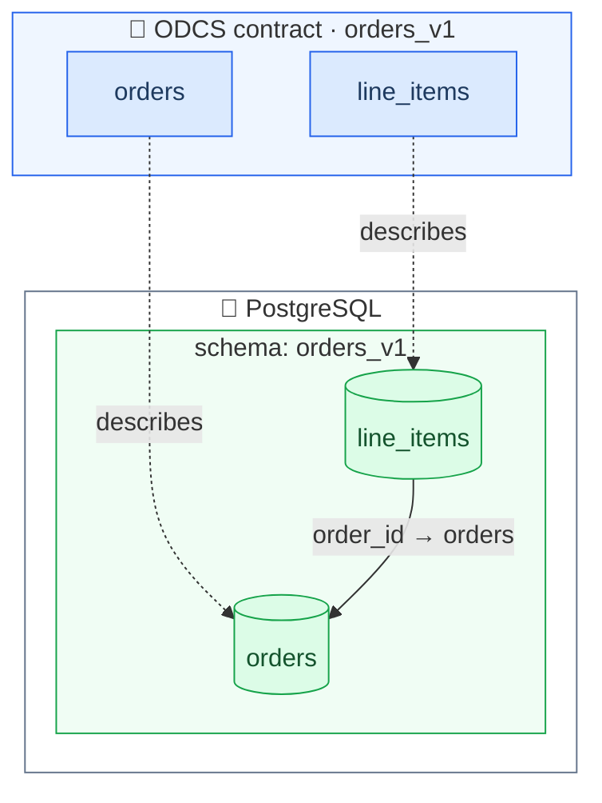
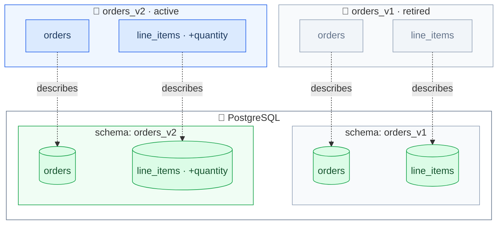

# Exercise 2: Data Contract Evolution

The business wants to track *how many* units of an item are bought per order.
The orders team introduces a new column `quantity` in the `line_items` table.
It defaults to 1, but it is still a breaking change for data consumers — any downstream pipeline or report that relies on a fixed set of columns will need to be updated.
So you release it as a new major version: `orders_v2`.

_Where we are — a single contract over the `orders_v1` tables:_



The `orders_v2` schema holds both tables — `orders` is unchanged, `line_items` has the new `quantity` column:

```sql
\dt orders_v2.*
SELECT * FROM orders_v2.orders LIMIT 5;
SELECT * FROM orders_v2.line_items LIMIT 5;
```

You should see something like this:

   ```text
                  order_id               |    order_timestamp     | order_total |     customer_id      | customer_email_address 
   --------------------------------------+------------------------+-------------+----------------------+------------------------
   a8c38fec-2acd-4b55-883b-4b48572d4a26 | 2020-01-01 00:00:00+00 |       29747 | 6GSHKOZIEN           | test394@example.org
   9e44da97-4f72-4bcf-821a-9d9500d06651 | 2020-01-01 10:37:00+00 |       55156 | ZN661MOMVMQXRJ       | test4757@example.org
   8fc4621c-66ae-4031-91f1-5313beb9f541 | 2020-01-01 20:14:00+00 |       85365 | NF0PRHKQP9W9Q0MTC87P | test1991@example.org
   98d48daf-3532-4a59-b7c2-3777164bdc65 | 2020-01-02 06:51:00+00 |         265 | QG9ZQ32YAQKY         | test3491@example.org
   2fd9df43-77e8-4d00-b380-ab270e8b73f8 | 2020-01-02 16:28:00+00 |       18130 | LNJ3SQAMEY3ZY        | test6705@example.org
   (5 rows)
   ```

   ```text
               lines_item_id             |               order_id               |      sku      | quantity 
   --------------------------------------+--------------------------------------+---------------+----------
   94aa82c8-50ba-47fb-994a-9b041b4127af | a8c38fec-2acd-4b55-883b-4b48572d4a26 | D3KT74L5EV46T |        1
   d67c963f-42a4-4aa8-afff-d7869008e3a9 | 9e44da97-4f72-4bcf-821a-9d9500d06651 | E202K62FT     |        3
   270ad2c1-f651-438e-a81a-d77713c1d3a3 | 8fc4621c-66ae-4031-91f1-5313beb9f541 | 1O7RID9Y5QJ   |        1
   cc763a72-cc07-4bc4-8ddf-c88d09db5daa | 98d48daf-3532-4a59-b7c2-3777164bdc65 | 7KJ8466FI39LW |        5
   d7ea7f72-a266-469c-a9ef-60063d5ac243 | 2fd9df43-77e8-4d00-b380-ab270e8b73f8 | 7HXBABF0AOT5  |        2
   (5 rows)
   ```

The raw data is also available as JSON files in [`data/orders_v2/`](/data/orders_v2/).


## Create v2

1. Copy your data contract from [Exercise 1](exercise1-put-your-data-under-contract.md) to `orders_v2.odcs.yaml`

   ```bash
   cp orders_v1.odcs.yaml orders_v2.odcs.yaml
   ```
   
2. Open it in the [Data Contract Editor]) (use the hamburger menu to load the file).

3. Introduce the new major version by updating the **Fundamentals**:
    
   - **ID**: `orders_v2`
   - **Version**: `2.0.0`
   - **Status**: `draft`
   
4. Update your **Servers** → **Orders**:

   - **Schema**: `orders_v2`
   
5. Update your **Data Quality** SQL queries to reference the new schema: change `orders_v1.` to `orders_v2.` (e.g. the `customer_email_address` check under **Schemas** → `orders`).
   Otherwise the checks would still run against the old `orders_v1` tables.

6. In **Schemas** → `line_items`, add the `quantity` property (Logical Type `integer`, Physical Type `BIGINT`), and add a **Data Quality** rule requiring it to be greater than 0.

7. Save the updated contract.
   Run the tests and make sure they pass:

   ```bash
   datacontract test orders_v2.odcs.yaml
   ```


## Execute the Migration

> [!NOTE]
> A full migration goes through this lifecycle:
>
> 1. release v2: set status to `active`,
> 2. deprecate v1: set status to `deprecated` plus an `endOfSupport` SLA property with a concrete date,
> 3. announce the migration in the support channel, and
> 4. retire v1 once nobody queries it anymore: set status to `retired`.


8. As a shortcut for this workshop, jump straight to the end state: set [`orders_v1.odcs.yaml`](../../orders_v1.odcs.yaml) to `retired` and [`orders_v2.odcs.yaml`](../../orders_v2.odcs.yaml) to `active` in your contract files.

_After this exercise — a new `orders_v2` contract over the evolved tables; `orders_v1` is retired:_




[Data Contract Editor]: <https://editor.datacontract.com>
