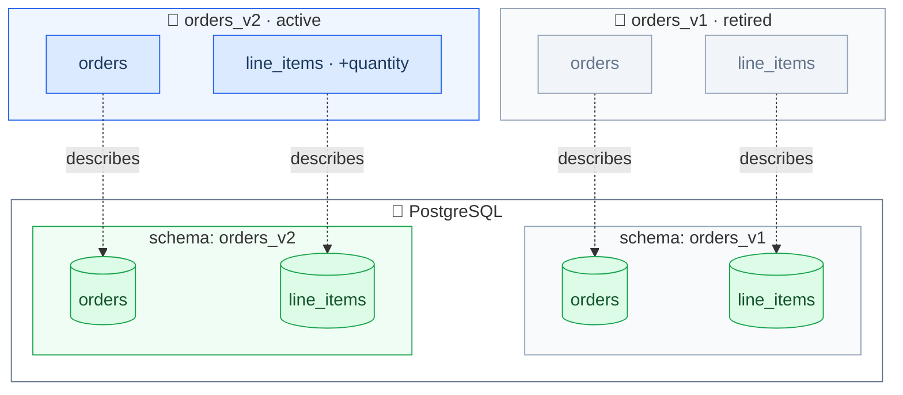
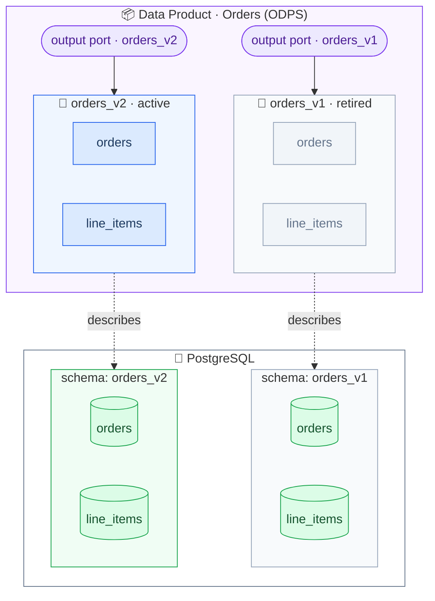

# Exercise 3: Describe Your Data Product

The data contracts from [Exercise 1](exercise1-put-your-data-under-contract.md) and [Exercise 2](exercise2-data-contract-evolution.md) describe the *interface* of your data.
But consumers also want to know about the **data product** behind it:
who owns it, what it is for, and which contracts it offers.
That is what the [Open Data Product Standard] (ODPS) is for.

Note that there is *one* data product — even though it currently offers *two* contract versions.
The product is the stable unit of ownership; its ports evolve.

_Where we are — two contracts, still just files on disk:_




## Create the Data Product

1. Create a new file `orders.odps.yaml` with this skeleton:

   ```yaml
   apiVersion: v1.0.0
   kind: DataProduct
   id: orders # snake_case of the name
   name: Orders
   version: 1.0.0 # the version of the data product, independent of the contract versions
   status: active
   domain: ecommerce
   description:
     purpose: # what is this data product for?
     limitations: # what should consumers know before using it?
   ```

   Replace the `purpose` and `limitations` comments with real text.

2. Add an **output port** per data contract.
   The `contractId` must match the `id` of the respective data contract.
   Entropy Data reads a display name and the server connection from `customProperties`:

   ```yaml
   outputPorts:
     - name: orders_v1
       description: Orders and line items tables in PostgreSQL (v1, superseded by v2)
       version: 1.0.0
       contractId: orders_v1
       customProperties:
         - property: displayName
           value: Orders v1
         - property: server
           value:
             type: postgres
             host: localhost
             port: 5433
             database: workshop
             schema: orders_v1
     - name: orders_v2
       description: # ...
       version: 2.0.0
       contractId: orders_v2
       customProperties:
         # ... displayName and server for v2
   ```

3. Add `team` and `support` — you can reuse what you defined in the contracts:

   ```yaml
   team:
     name: order_data_team
     members:
       - username: owner@example.com
         role: Owner

   support:
     - channel: "#order-data-help"
       url: https://example.slack.com/archives/order-data-help
       tool: slack
   ```

## Validate

4. Validate your data product description against the official JSON schema:

   ```bash
   uvx check-jsonschema --schemafile schemas/odps-json-schema-v1.0.0.json orders.odps.yaml
   ```

_After this exercise — one ODPS data product bundles both contracts, exposing each as an output port:_



[Open Data Product Standard]: <https://bitol-io.github.io/open-data-product-standard/latest/>
