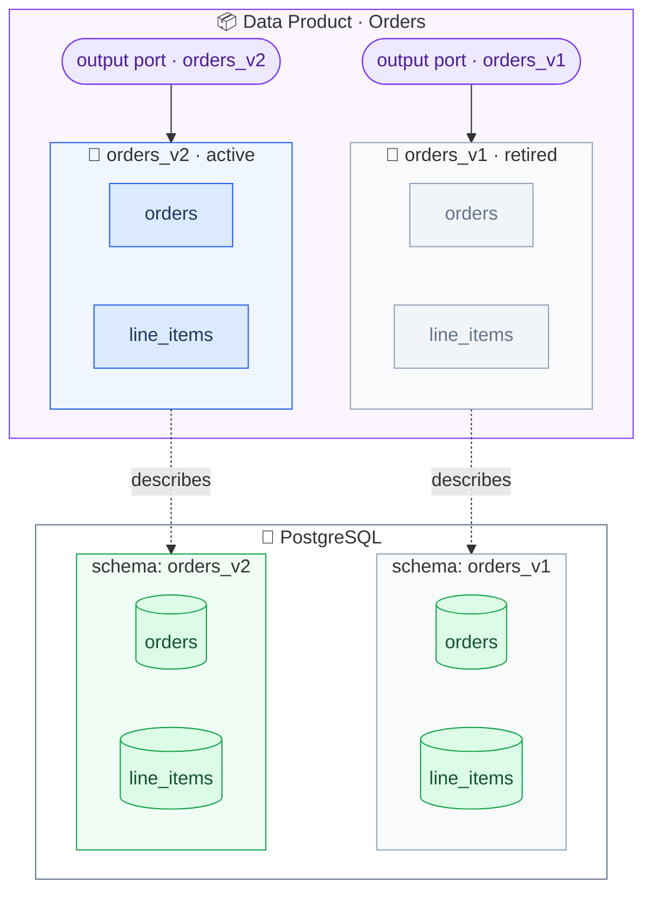
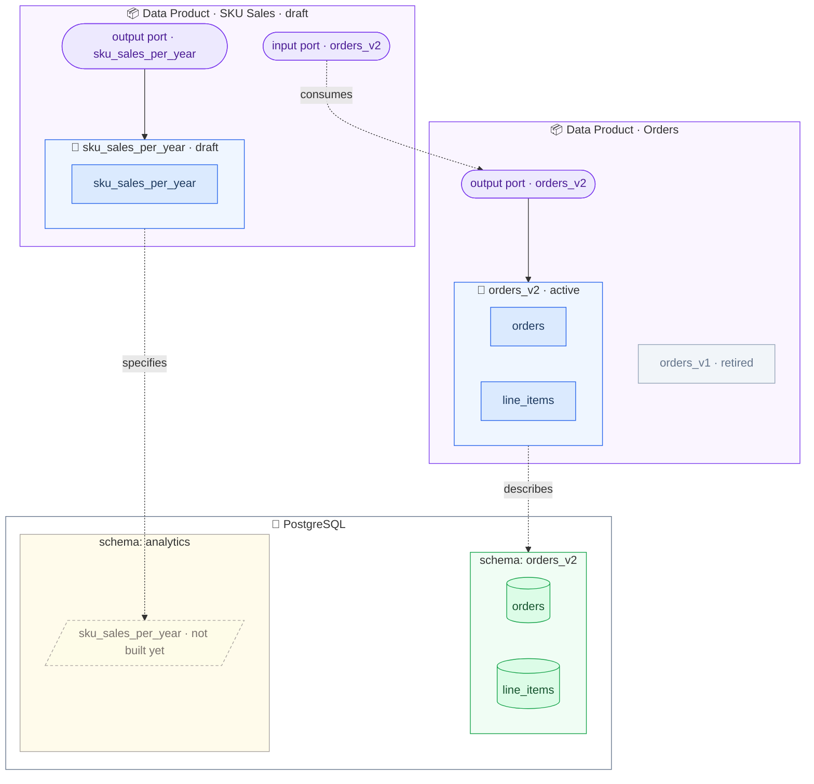

# Exercise 4: Design Your Data Product

**Scenario:** The **purchasing team** wants to know how often each SKU is bought, grouped by year, to negotiate better deals with suppliers. You will build a derived data product on top of the orders data.

You work **contract-first**: before writing any SQL, you design the data contract and the data product description. The contract is the specification — you will implement it in [Exercise 5](exercise5-implement-your-data-product.md).

You consume the `orders_v2` contract — it guarantees you the `quantity` column.

_Where we are — the Orders data product, ready to be consumed:_



## Design the Contract

1. Create a new data contract in the [Data Contract Editor]:
     
   - **Name**: `SKU Sales per Year`
   - **ID**: `sku_sales_per_year`
   - **Version**: `1.0.0`
   - **Status**: `draft`
   
2. Add a **Server**:

   - **Type**: `postgres`
   - **Host**: `localhost`
   - **Port**: `5433`
   - **Database**: `workshop`
   - **Schema**: `analytics`

3. Add a **Schema**
   
   - **Name**: `sku_sales_per_year`
   - **Advanced Metadata** → **Physical Type**: `VIEW`
   - **Properties**:

     | Property         | Logical Type | Physical Type | Meaning                           |
     |------------------|--------------|---------------|-----------------------------------|
     | `sku`            | `string`     | `TEXT`        | The product SKU                   |
     | `year`           | `integer`    | `INTEGER`     | Year of the order                 |
     | `order_count`    | `integer`    | `BIGINT`      | How many orders contained the SKU |
     | `total_quantity` | `integer`    | `BIGINT`      | Total units bought                |

4. Add quality checks that capture the *semantics* of the view, e.g.:
     
   - The combination of `sku` and `year` is unique
   - `total_quantity` is never less than `order_count`
   - The view is not empty

5. Save it locally as `sku_sales_per_year.odcs.yaml` and run the tests:

   ```bash
   datacontract test sku_sales_per_year.odcs.yaml
   ```

   The tests **fail** — of course, nothing is implemented yet! That is the point of contract-first:
   consumers can already review the interface while you turn the red tests green in the next exercise.


## Describe the Data Product

5. Create `sku_sales_per_year.odps.yaml`, following the same structure as in [Exercise 3]:
   
   - **ID**: `sku_sales`
   - **Name**: `SKU Sales`
   - **Status**: `draft`
   - **Domain** `ecommerce`

6. Add an **output port** referencing your `sku_sales_per_year` contract — like in [Exercise 3] with `displayName` and the `server` as `customProperties`:

   ```yaml
   outputPorts:
     - name: sku_sales_per_year
       version: 1.0.0
       contractId: sku_sales_per_year
       customProperties:
         - property: displayName
           value: SKU Sales per Year
         - property: server
           value:
           type: postgres
           host: localhost
           port: 5433
           database: workshop
           schema: analytics
      ```
 
7. Add an **input port** referencing the `orders_v2` contract — this declares which data (and which guarantees!) your product builds on:

   ```yaml
   inputPorts:
     - name: orders
       version: 2.0.0
       contractId: orders_v2
   ```

8. Add `team` and `support` for the purchasing analytics team.

9. Validate:

   ```bash
   uvx check-jsonschema --schemafile schemas/odps-json-schema-v1.0.0.json sku_sales_per_year.odps.yaml
   ```

_After this exercise — the SKU Sales product is designed contract-first: an input port consumes `orders_v2`, the output contract is written, but the view is only specified (dashed — you build it next):_



[Exercise 3]: <../part-a/exercise3-describe-your-data-product.md>
[Data Contract Editor]: <https://editor.datacontract.com>
