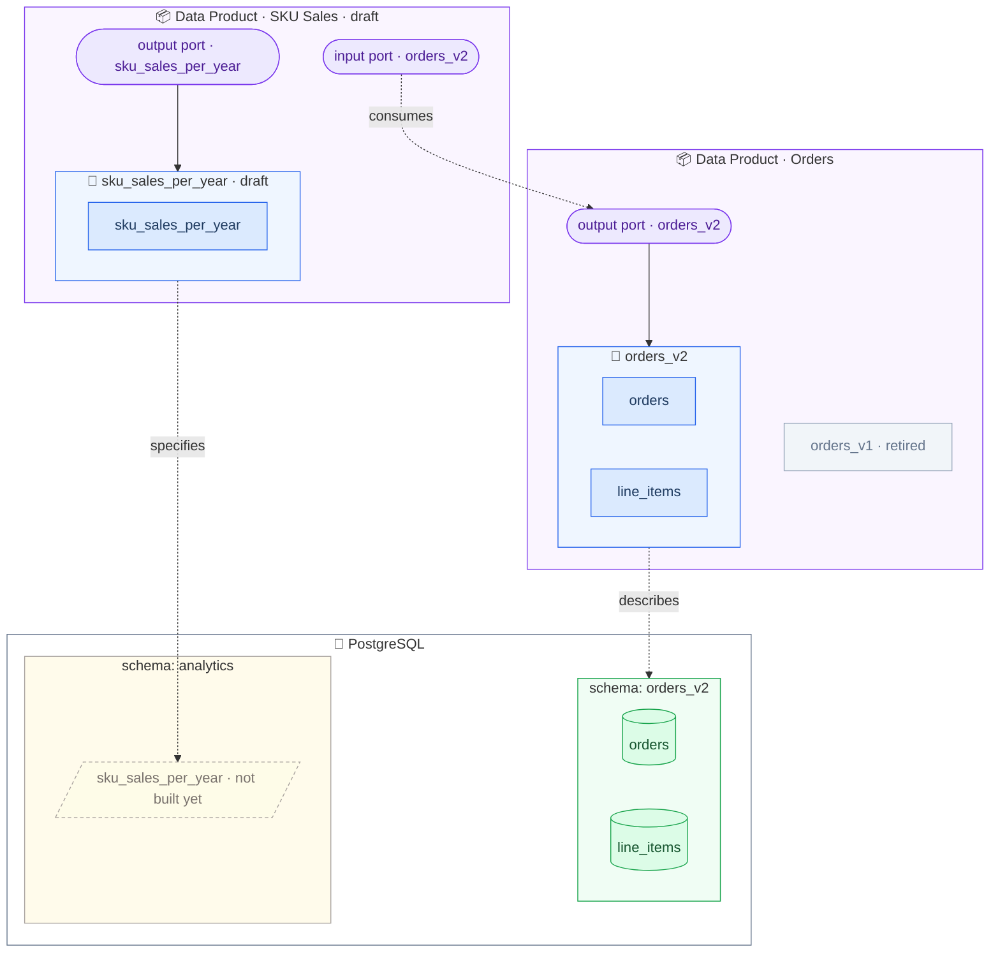
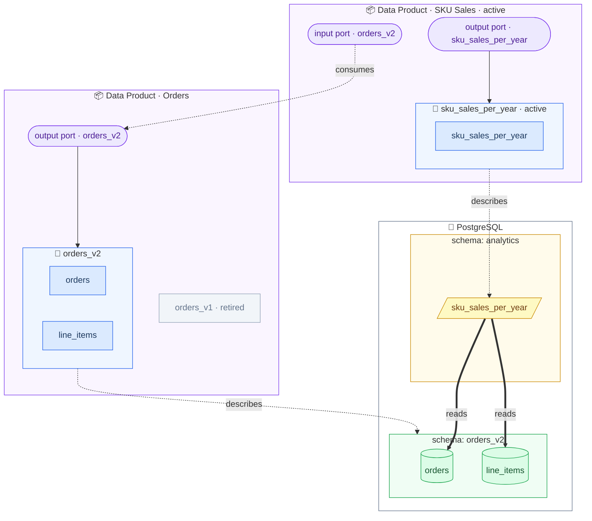

# Exercise 5: Implement Your Data Product

In [Exercise 4](exercise4-design-your-data-product.md) you designed the contract — now fulfill it: a SQL view `analytics.sku_sales_per_year` on top of the `orders_v2` schema that makes your contract tests pass.

This is the perfect task for an **AI coding agent**: your data contract is machine-readable metadata that specifies exactly what to build, and `datacontract test` gives the agent a feedback loop to verify its work.

_Where we are — the contract is designed, but the view does not exist yet (dashed):_




## Implement with an AI Coding Agent

1. Start your AI coding agent of choice (Claude Code, Codex, Copilot, ...) in the repository and prompt it, for example:

   > Implement a PostgreSQL view that fulfills the data contract in `sku_sales_per_year.odcs.yaml`. The source data is described by the contract `orders_v2.odcs.yaml`. Apply it to the database with `docker compose exec postgres psql -U workshop -d workshop`. Then verify with `datacontract test sku_sales_per_year.odcs.yaml` (username and password are `workshop`) and iterate until all tests pass.

2. Watch what the agent does:

   - Does it read both contracts — yours for the target, `orders_v2` for the source?
   - Does it run the tests and react to failures?
   - The repository tells agents not to peek into `solutions/` — it has to work from the contract, just like a real engineer would.


## Or Implement Manually

You can also do it yourself:

```sql
CREATE SCHEMA IF NOT EXISTS analytics;

CREATE OR REPLACE VIEW analytics.sku_sales_per_year AS
SELECT
    -- your transformation here
FROM orders_v2.line_items li
JOIN orders_v2.orders o ON li.order_id = o.order_id
GROUP BY ...;
```

> [!TIP]
> `EXTRACT(YEAR FROM order_timestamp)` returns a `numeric` in PostgreSQL — cast it with `::int`. The same goes for `SUM(quantity)`, which returns `numeric` — cast it with `::bigint`. Types matter: they are part of your contract!


## Go Live

3. Make sure the tests are green:

   ```bash
   datacontract test sku_sales_per_year.odcs.yaml
   ```

4. Your data product is live — set the `status` to `active` in both the [sku_sales_per_year.odcs.yaml](../../sku_sales_per_year.odcs.yaml) and the [sku_sales_per_year.odps.yaml](../../sku_sales_per_year.odps.yaml)!

_After this exercise — the analytics view is live and reads the `orders_v2` tables directly (thick edges = the broad dependency Exercise 6 will narrow):_


