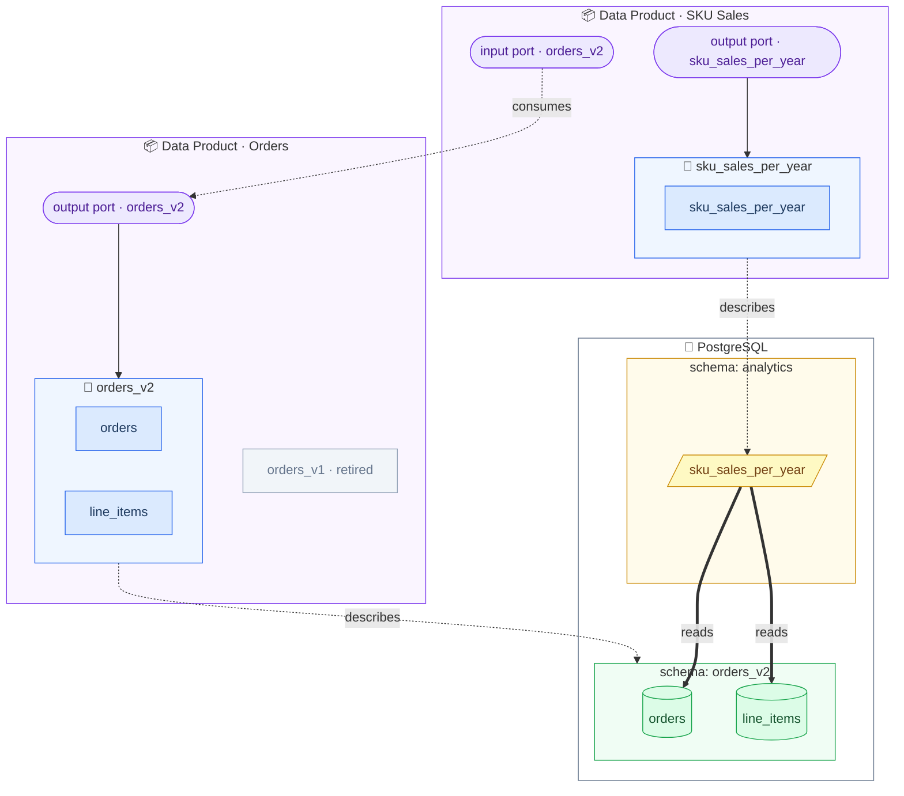
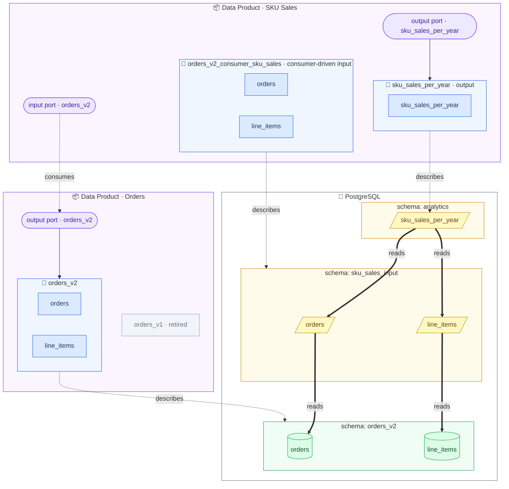

# Exercise 6: Consumer-Driven Data Contracts

A consumer-driven data contract lets the *consumer* define what subset of data they need and what quality they expect. This enables the producer to understand actual usage and avoid breaking real consumers.

Your view from [Exercise 5](exercise5-implement-your-data-product.md) reads the producer's tables directly — it implicitly depends on the whole `orders_v2` contract, even though it only needs five fields. Make that explicit: define a consumer-driven contract for exactly those fields, and create views so you access only what you actually need.

_Where we are — your view reads the producer's tables directly (thick edges), coupling you to all of `orders_v2`:_




## Define What You Need

1. Copy your `orders_v2.odcs.yaml` to `orders_v2.consumer_sku_sales.odcs.yaml` and open it in the [Data Contract Editor](https://editor.datacontract.com).
   Set the ID to `orders_v2_consumer_sku_sales` and keep the version at `2.0.0` — it is based on the v2 data.
 
2. Strip it down to what your view actually uses, and remove everything else (including quality checks on removed fields):
    
   - `orders`: `order_id`, `order_timestamp`
   - `line_items`: `order_id`, `sku`, `quantity`

   Keep the `quantity > 0` quality check — your data product relies on it!

3. This is *your* contract now, not the orders team's: change the owner. Set `team` and `support` to the purchasing analytics team, and rewrite the `description.purpose` (e.g., "The fields the SKU Sales data product actually needs from orders_v2").

4. Change the server schema to `sku_sales_input` and the `physicalType` of both schema objects to `VIEW` — this is where your access views will live.
   
   If the kept `quantity > 0` check is a SQL query, update its schema reference from `orders_v2.` to `sku_sales_input.`, otherwise it would still test the old tables.

5. Run the tests — they fail, because the views do not exist yet:

   ```bash
   datacontract test orders_v2.consumer_sku_sales.odcs.yaml
   ```


## Create the Views

6. Create views that expose only the contracted fields (connect with `docker compose exec postgres psql -U workshop -d workshop`):

   ```sql
   CREATE SCHEMA IF NOT EXISTS sku_sales_input;

   CREATE OR REPLACE VIEW sku_sales_input.orders AS
   SELECT order_id, order_timestamp FROM orders_v2.orders;

   CREATE OR REPLACE VIEW sku_sales_input.line_items AS
   SELECT order_id, sku, quantity FROM orders_v2.line_items;
   ```

7. Run the tests again — green.


## Rebase Your Data Product

8. Recreate your `analytics.sku_sales_per_year` view so it selects from `sku_sales_input.orders` and `sku_sales_input.line_items` instead of the `orders_v2` tables.

9. Verify that your consumers are unaffected:

   ```bash
   datacontract test sku_sales_per_year.odcs.yaml
   ```

Your data product now touches only the fields in your consumer-driven contract.
The producer can see exactly what you depend on — everything else in `orders_v2` may change without breaking you.
Best of all: the orders team can run *your* contract (`datacontract test`) in *their* CI pipeline, and catch a change that would break you before it ever ships.

_After this exercise — narrow input views and a consumer-driven contract sit between you and the producer; your analytics view only ever touches the five fields you need:_


